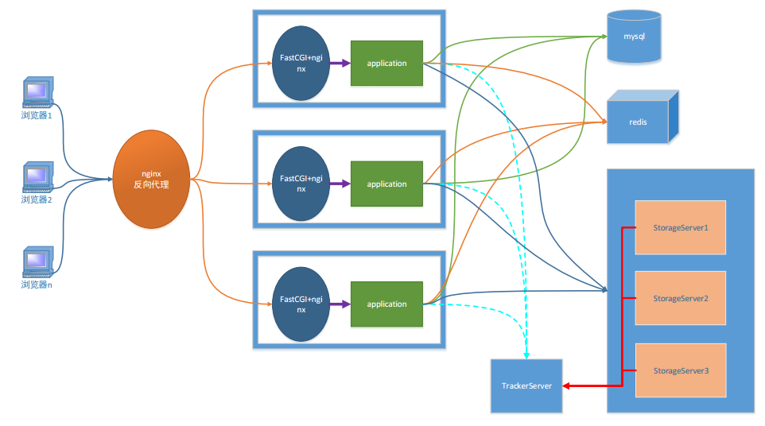
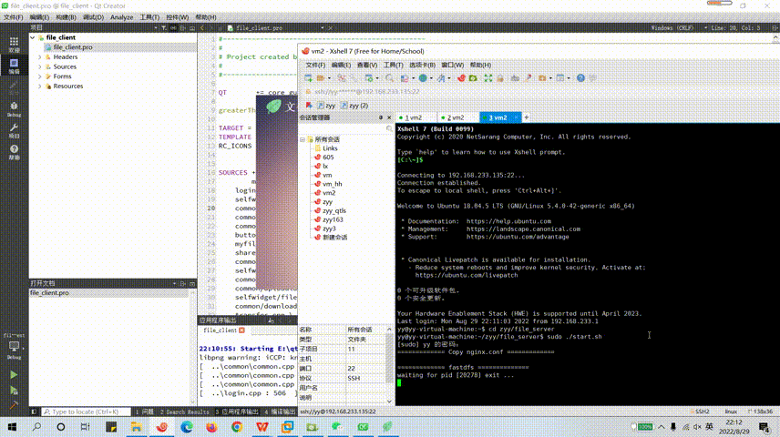

# FileTransfer
Linux环境中搭建了C/S架构的文件传输服务器，通过Qt实现支持HTTP协议的客户端。

## 功能详情

- 使用Nginx作为Web服务器实现文件、html等静态资源请求，fastCGI帮助服务器实现动态请求；
- 使用Nginx的反向代理服务器功能，使客户端不直接访问Web服务器,由Nginx将指令转发给服务器；
- 利用MySQL存储文件属性、用户信息，Redis提高效率，fastDFS分布式文件系统存储文件内容；
- 客户端利用Qt实现支持HTTP协议，最终够实现用户登录注册功能，支持大文件的上传和下载。

## 环境要求

* Linux（虚拟机 Ubuntu 18.04）
* C++11
* MySQL
* Redis
* Nginx
* fastCGI
* fastDFS
* Qt

## 项目架构图



1. 客户端
   - 网络架构:
     - b/s
       - 必须使用http协议
     - c/s
       - 协议可以随意选择
       - Qt -> http
2. 服务器
   - Nginx
     - 能处理静态请求 -> html, jpg
     - 动态请求无法处理
     - 服务器集群之后, 每台服务器上部署的内容必须相同
   - fastCGI
     - 帮助服务器处理动态请求
3. 反向代理服务器
   - 客户端并不能直接访问web服务器, 直接访问到的是反向代理服务器
   - 客户端静请求发送给反向代理服务器, 反向代理将客户端请求转发给web服务器
4. 关系型数据库
   - 存储文件属性信息
   - 用户的属性信息
5. redis - 非关系型数据库 (内存数据库)
   - 作用提出程序效率
   - 存储是服务器经常要从关系型数据中读取的数据
6. FASTDFS - 分布式文件系统
   - 存储文件内容
   - 供用户下载

## 项目启动

按resource/mysql_filetransfer.sql配置数据库

首先将服务器运行起来

```bash
make
./start.sh
```

然后使用Qt运行客户端

## 效果展示


